**Mybatis**

环境：

+ jdk 1.8
+ Mysql 5.7
+ maven 3.6.1
+ IDEA


### 1 简介


+ MyBatis 是一款优秀的**持久层框架**，它支持自定义 SQL、存储过程以及高级映射。MyBatis **免除了几乎所有的 JDBC 代码**以及设置参数和获取结果集的工作。MyBatis 可以通过简单的 XML 或注解来配置和映射原始类型、接口和 Java POJO为数据库中的记录。

+ MyBatis本是apache的一个[开源项目](https://baike.baidu.com/item/开源项目/3406069?fromModule=lemma_inlink)iBatis，2010年这个项目由apache software foundation迁移到了[google code](https://baike.baidu.com/item/google code/2346604?fromModule=lemma_inlink)，并且改名为MyBatis。2013年11月迁移到[Github](https://baike.baidu.com/item/Github/10145341?fromModule=lemma_inlink)。


github:https://github.com/mybatis/mybatis-3/tree/mybatis-3.5.13

文档：https://mybatis.org/mybatis-3/zh/index.html

Maven：

```xml
<!-- https://mvnrepository.com/artifact/org.mybatis/mybatis -->
<dependency>
    <groupId>org.mybatis</groupId>
    <artifactId>mybatis</artifactId>
    <version>3.5.2</version>
</dependency>

```

==持久层==

**数据持久化**

+ 持久化就是将程序的数据在持久状态和瞬时状态转化的过程
+ 内存有断电即失的特性
+ 数据库(JDBC)，io文件持久化

**为什么需要持久化？**

有一些对象不能丢失，内存太贵了


持久层：

Dao层、Service层、Controller层...

+ 完成持久化工作的代码块
+ 层界限十分明显

**为什么需要Mybatis**

+ 方便，传统的JDBC复杂，需要框架简化、自动化

+ 帮关注将数据存入到数据库中

+ 不用Mybatis也可以~


### 2 第一个Mybatis程序

思路 ： 搭建环境 --> 导入Mybatis -->编写代码 --> 测试


#### 2.1 搭建环境

**搭建数据库**

```mysql
CREATE DATABASE `mybatis`;

USE `mybatis`;

CREATE TABLE `user`(
`id` INT(20) NOT NULL PRIMARY KEY,
`name` VARCHAR(30) DEFAULT NULL,
`pwd` VARCHAR(30) DEFAULT NULL`user`

)ENGINE = INNODB DEFAULT CHARSET=utf8mb4;

INSERT INTO `user` (`id`,`name`,`pwd`) VALUES
(1,'lk','123456'),
(2,'hxf','123456'),
(3,'zxm','123456')
```

**新建项目**

1 新建一个普通maven项目

2 删除src目录

3 导入maven依赖

+ mysql驱动
+ mybatis
+ junit

#### 2.2 创建模块

+ 编写mybatis的核心配置文件

```xml
<?xml version="1.0" encoding="UTF-8" ?>

<?import java.lang.*?>
<?import java.util.*?>
<?import javafx.scene.*?>
<?import javafx.scene.control.*?>
<?import javafx.scene.layout.*?>


<!DOCTYPE configuration
        PUBLIC "-//mybatis.org//DTD Config 3.0//EN"
        "https://mybatis.org/dtd/mybatis-3-config.dtd">
<configuration>
    <environments default="development">
        <environment id="development">
            <transactionManager type="JDBC"/>
            <dataSource type="POOLED">
                <property name="driver" value="$com.mysql.jdbc.Driver"/>
                <property name="url" value="jdbc:mysql://localhost:3306/mybatis?useSSL=true&amp;useUnicode=true"/>
                <property name="username" value="${username}"/>
                <property name="password" value="${password}"/>
            </dataSource>
        </environment>
    </environments>
    <mappers>
        <mapper resource="org/mybatis/example/BlogMapper.xml"/>
    </mappers>
</configuration>
```


+ 编写Mybatis工具类

```java
public class MybatisUtils {
    private static SqlSessionFactory sqlSessionFactory;
    static {

        InputStream inputStream = null;
        try {
            //使用Mybatis 第一步 ：获取sqlSessionFactory对象
            String resource = "org/mybatis/example/mybatis-config.xml";
            inputStream = Resources.getResourceAsStream(resource);
        } catch (IOException e) {
            throw new RuntimeException(e);
        }
        sqlSessionFactory = new SqlSessionFactoryBuilder().build(inputStream);

    }
//    既然有了 SqlSessionFactory，顾名思义，我们可以从中获得 SqlSession 的实例。
//    SqlSession 提供了在数据库执行 SQL 命令所需的所有方法。

    public static SqlSession getSqlSession() {
//        SqlSession sqlSession = sqlSessionFactory.openSession();
//        return sqlSession;
        return sqlSessionFactory.openSession();
    }

}
```

#### 2.3 编写代码

+ 实体类

```java
public class User {
    private int id;
    private String name;
    private String pwd;

    public User() {
    }

    public User(int id, String name, String pwd) {
        this.id = id;
        this.name = name;
        this.pwd = pwd;
    }

    public int getId() {
        return id;
    }

    public void setId(int id) {
        this.id = id;
    }

    public String getName() {
        return name;
    }

    public void setName(String name) {
        this.name = name;
    }

    public String getPwd() {
        return pwd;
    }

    public void setPwd(String pwd) {
        this.pwd = pwd;
    }

    @Override
    public String toString() {
        return "User{" +
                "id=" + id +
                ", name='" + name + '\'' +
                ", pwd='" + pwd + '\'' +
                '}';
    }
}
```


+ Dao接口

```java
public interface UserDao{
    List<User> getUserList();
}
```


+ 接口实现类

==由原来的UserDaoImpl转换为一个Mapper配置文件==

```xml
<?xml version="1.0" encoding="UTF-8" ?>
<!DOCTYPE mapper
        PUBLIC "-//mybatis.org//DTD Mapper 3.0//EN"
        "https://mybatis.org/dtd/mybatis-3-mapper.dtd">
<!--namespace 绑定一个对应的Dao接口-->
<mapper namespace="com.lk.Dao.UserDao">
    <!--id 对应实现接口的方法名字-->
    <select id="getUserList" resultType="com.lk.pojo.User">
        select * from mybatis.user
    </select>
</mapper>
```

#### 2.4 测试

+ junit测试

```java
public class UserDaoTest {
    @Test
    public void test(){
        //获得sqlSession对象
        SqlSession sqlSession = MybatisUtils.getSqlSession();

        //方式一：getMapper
        UserDao mapper = sqlSession.getMapper(UserDao.class);
        List<User> userList = mapper.getUserList();
        for (User user : userList) {
            System.out.println(user);
        }

        //关闭SqlSession
        sqlSession.close();

    }
}
```

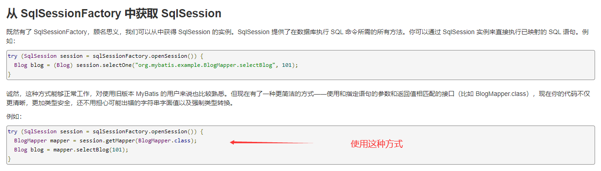

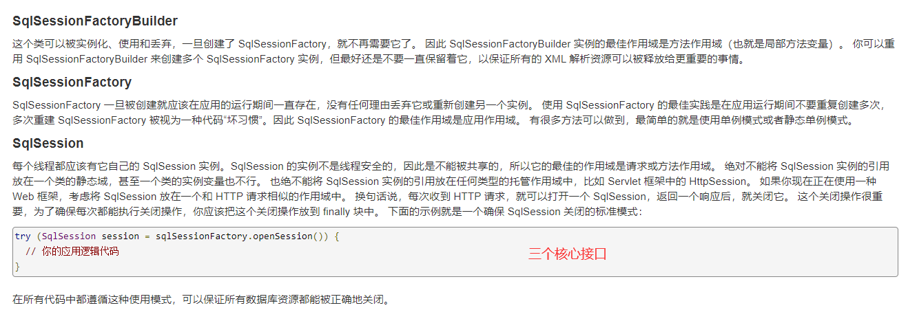


### 3 增删改查实现

==namespace== 

Mapper.xml配置文件中 **namespace** 中的包名要和Dao/mapper接口的包名一致！

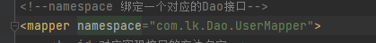

+ select

选择，查询语句  `select * from mybatis.user`

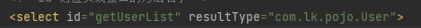

**id** 就是对应的namespace中的方法名；

  

**resultType** 就是Sql语句执行的返回值


+ insert

编写接口——编写对应Mapper中的sql语句——测试

```java
int addUser(User user);
```

```xml
    <insert id="addUser" parameterType="com.lk.pojo.User" >
        insert into mybatis.user (id,name,pwd) values (#{id},#{name},#{pwd});
    </insert>
```

```java
    @Test
    public void addUser(){
        SqlSession sqlSession = MybatisUtils.getSqlSession();
        UserMapper mapper = sqlSession.getMapper(UserMapper.class);
        int num = mapper.addUser(new User(4, "mxn", "123456"));

        if (num>0){
            System.out.println("插入成功");
        }

        //提交事务
        sqlSession.commit();

        sqlSession.close();
    }
```


+ update
+ delete

`在Mapper.xml文件中编写SQL语句不自动提示解决办法：`

第一步：确定连接到对应数据库

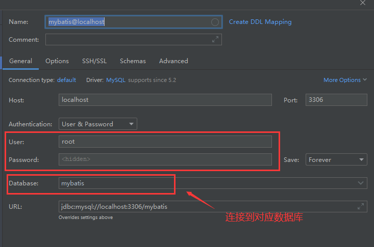

第二步：设置SQL方言

File - Settings - Languages&Frameworks - SQL Dialects

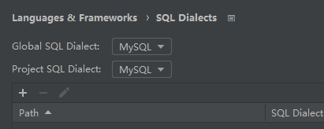

File - Settings - Languages&Frameworks - SQL Resolution Scopes

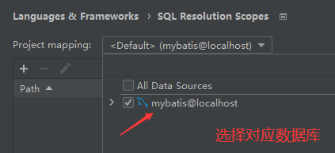

效果  自动提示补全语句

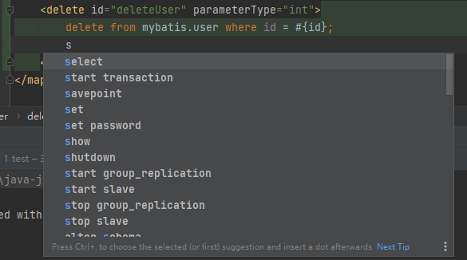

#### 分析错误

+ 标签匹配错误

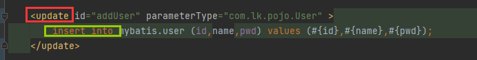


+ resource绑定Mapper需要使用路径

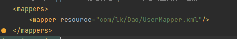

com/lk/Dao/...  使用/不使用 .


+  空指针异常


### 4 Map拓展和模糊查询

#### 万能Map

假设实体类或者数据库中的表，字段或者参数过多，应当考虑使用Map（万能map）

```java
int addUser2(Map<String,Object> map);
```

```xml
    <update id="addUser2" parameterType="map" >
        insert into mybatis.user (id,name,pwd) values (#{userid},#{userName},#{pwd});
    </update>
```

```java
    @Test
    public void addUser2(){
        SqlSession sqlSession = MybatisUtils.getSqlSession();
        UserMapper mapper = sqlSession.getMapper(UserMapper.class);

        HashMap<String, Object> map = new HashMap<>();
        map.put("userid",4);
        map.put("userName","gpx");
        map.put("pwd","123456");
        mapper.addUser2(map);

        sqlSession.commit();
        sqlSession.close();
    }
```

Map传递参数，直接在sql中取出key即可  【parameterType="map"】

对象传递参数，直接在sql中取对象的属性即可 【 parameterType="Object"】

只有一个基本类型参数的情况下，可以直接在sql中取到  


多个参数用Map 或者 **注解**


#### 模糊查询

Java代码执行的时候 ，传递通配符 % %


```java
List<User> userList = mapper.getUserLike("%f%");
```


在SQL拼接中使用通配符

```xml
    <select id="getUserLike" resultType="com.lk.pojo.User">
        select * from mybatis.user where name like "%"#{value}"%"
    </select>
```

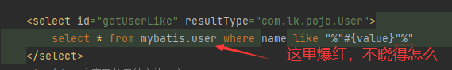


### 5 配置解析

配置文档的顶层结构：

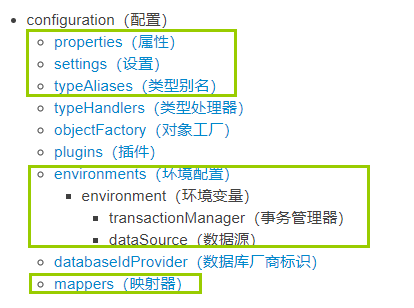

#### 环境配置environments

MyBatis 可以配置成适应多种环境

**尽管可以配置多个环境，但每个 SqlSessionFactory 实例只能选择一种环境。**

```xml
<environments default="development">
  <environment id="development">
    <transactionManager type="JDBC">
      <property name="..." value="..."/>
    </transactionManager>
    <dataSource type="POOLED">
      <property name="driver" value="${driver}"/>
      <property name="url" value="${url}"/>
      <property name="username" value="${username}"/>
      <property name="password" value="${password}"/>
    </dataSource>
  </environment>
</environments>
```

- 默认使用的环境 ID（比如：default="development"）。

- 每个 environment 元素定义的环境 ID（比如：id="development"）。

- 事务管理器的配置（比如：type="JDBC"）

  - 在 MyBatis 中有两种类型的事务管理器（也就是 type="[JDBC|MANAGED]"）

    ==JDBC== – 这个配置直接使用了 JDBC 的提交和回滚功能（默认是JDBC）

    ==MANAGED== – 这个配置几乎没做什么。它从不提交或回滚一个连接。默认情况下它会关闭连接。然而一些容器并不希望连接被关闭，因此需要将 closeConnection 属性设置为 false 来阻止默认的关闭行为

    `如果你正在使用 Spring + MyBatis，则没有必要配置事务管理器，因为 Spring 模块会使用自带的管理器来覆盖前面的配置。`

- 数据源的配置（比如：type="POOLED"）。

  + 三种内建的数据源类型: type="[UNPOOLED|POOLED|JNDI]"

​				 默认连接池（POOLED）

#### 属性（properties）

这些属性可以在外部进行配置，并可以进行动态替换。你既可以在典型的 Java 属性文件中配置这些属性，也可以在 properties 元素的子元素中设置。（db.properties）

编写一个配置文件

db.properties

```properties
driver = com.mysql.jdbc.Driver
url = "jdbc:mysql://localhost:3306/mybatis?useSSL=false&amp;useUnicode=true"
username = root
password = root
```

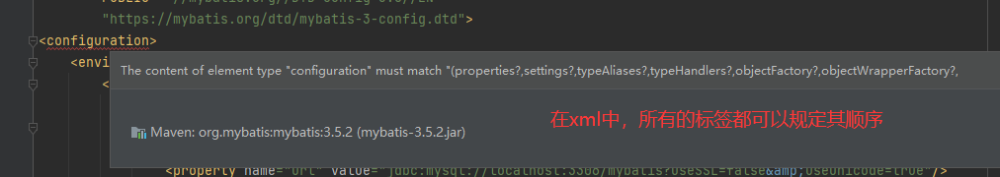


在核心配置文件中引入db.properties

```xml
    <!--引入外部配置文件-->
    <properties resource="db.properties">
        <!--
        <property name="username" value="root"/>
        <property name="password" value="root"/>
        -->

    </properties>
```

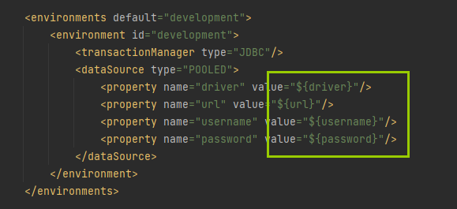

通过引入的db.properties访问到需要的参数对应值，如果不引入外部配置文件，则需要给参数赋值

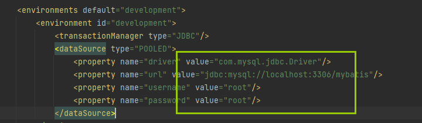

+ 可以直接引入外部文件
+ 可以在其中增加一些属性配置
+ 如果两个文件有同一个字段，优先使用外部配置文件的

#### 类型别名(typeAliases)

类型别名可为 Java 类型设置一个缩写名字。 它仅用于 XML 配置，降低冗余的全限定类名书写

```xml
    <typeAliases>
        <typeAlias type="com.lk.pojo.User" alias="User"/>
    </typeAliases>
```

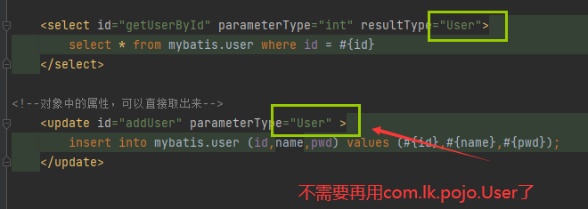


也可以指定一个包名，MyBatis 会在包名下面搜索需要的 Java Bean

```xml
    <typeAliases>
        <package name="com.lk.pojo"/>
    </typeAliases>
```

扫描实体类的包，他的默认别名就为这个类的类名，首字母小写（首字母大写也可以）

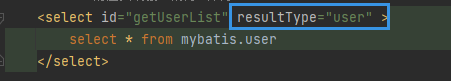


在实体类比较少的时候，使用第一种方式（第一种可以DIY别名）

如果实体类较多，建议使用第二种（不可DIY，如果非要改别名不使用user，需要在实体上增加注解）


#### 设置

这是 MyBatis 中极为重要的调整设置，它们会改变 MyBatis 的运行时行为

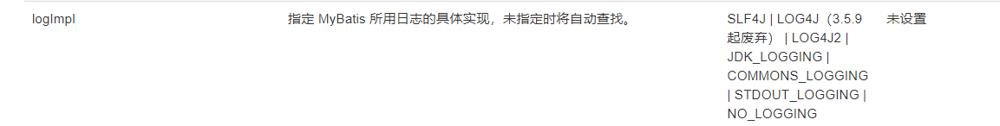

#### 其他配置

+ typeHandles（类型处理器）
+ objectFactory(对象工厂)
+ pluins （插件）
  + [mybatis-plus](https://mvnrepository.com/artifact/com.baomidou/mybatis-plus)
  + [mybatis-generator-core](https://mvnrepository.com/artifact/org.mybatis.generator/mybatis-generator-core)
  + 通用mapper


#### 映射器

MapperReister：注册绑定Mapper文件

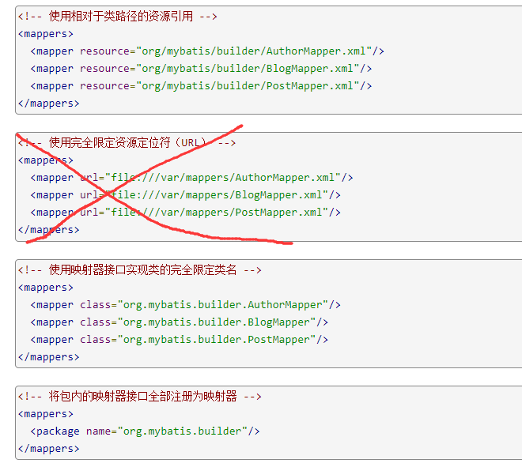

**方式一**

```xml
    <mappers>
        <mapper resource="com/lk/Dao/UserMapper.xml"/>
    </mappers>
```


方式二 使用class文件绑定注册

```xml
<!--    每一个Mapper.xml都需要在Mybatis核心配置文件中注册！-->
    <mappers>
        <mapper class="com.lk.Dao.UserMapper"></mapper>
    </mappers>
```

注意点：

+ 接口和他的Mapper配置文件必须同名
+ 接口和他的Mapper配置文件必须在同一个包下

**方式三 使用扫描包进行绑定**

```xml
<!--    每一个Mapper.xml都需要在Mybatis核心配置文件中注册！-->
    <mappers>
        <package name="com.lk.Dao"/>
    </mappers>
```

+ 接口和他的Mapper配置文件必须同名
+ 接口和他的Mapper配置文件必须在同一个包下


#### 生命周期和作用域

作用域和生命周期类别是至关重要的，因为错误的使用会导致非常严重的并发问题

+ **SqlSessionFactoryBuilder**

一旦创建了 SqlSessionFactory，就不再需要它了。SqlSessionFactoryBuilder 实例的最佳作用域是方法作用域（也就是局部方法变量）

+ **SqlSessionFactory**

一旦被创建就应该在应用的运行期间一直存在，可以想象为数据库连接池，没有任何理由丢弃它或重新创建另一个实例

SqlSessionFactory 的最佳作用域是应用作用域。 有很多方法可以做到，最简单的就是使用单例模式或者静态单例模式。

+ **SqlSession**

连接到连接池的一个请求

SqlSession 的实例不是线程安全的，因此是不能被共享的，所以它的最佳的作用域是请求或方法作用域

用完之后需要赶紧关闭，否则资源被占用


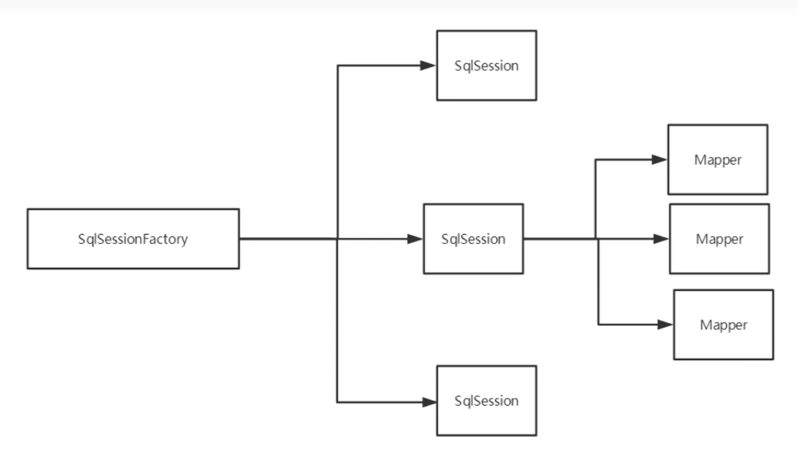

这里的每一个Mapper 就代表一个业务


### 6 解决属性名和字段名不一致的问题

数据库中的字段

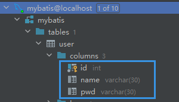


新建一个项目，拷贝之前的，测试实体类字段不一致


