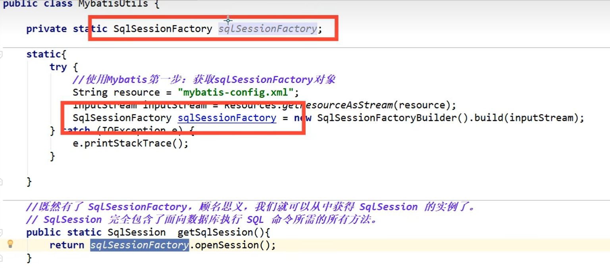

**Mybatis**

环境：

+ jdk 1.8
+ Mysql 5.7
+ maven 3.6.1
+ IDEA


### 1 简介


+ MyBatis 是一款优秀的**持久层框架**，它支持自定义 SQL、存储过程以及高级映射。MyBatis **免除了几乎所有的 JDBC 代码**以及设置参数和获取结果集的工作。MyBatis 可以通过简单的 XML 或注解来配置和映射原始类型、接口和 Java POJO为数据库中的记录。

+ MyBatis本是apache的一个[开源项目](https://baike.baidu.com/item/开源项目/3406069?fromModule=lemma_inlink)iBatis，2010年这个项目由apache software foundation迁移到了[google code](https://baike.baidu.com/item/google code/2346604?fromModule=lemma_inlink)，并且改名为MyBatis。2013年11月迁移到[Github](https://baike.baidu.com/item/Github/10145341?fromModule=lemma_inlink)。


github:https://github.com/mybatis/mybatis-3/tree/mybatis-3.5.13

文档：https://mybatis.org/mybatis-3/zh/index.html

Maven：

```xml
<!-- https://mvnrepository.com/artifact/org.mybatis/mybatis -->
<dependency>
    <groupId>org.mybatis</groupId>
    <artifactId>mybatis</artifactId>
    <version>3.5.2</version>
</dependency>

```

==持久层==

**数据持久化**

+ 持久化就是将程序的数据在持久状态和瞬时状态转化的过程
+ 内存有断电即失的特性
+ 数据库(JDBC)，io文件持久化

**为什么需要持久化？**

有一些对象不能丢失，内存太贵了


持久层：

Dao层、Service层、Controller层...

+ 完成持久化工作的代码块
+ 层界限十分明显

**为什么需要Mybatis**

+ 方便，传统的JDBC复杂，需要框架简化、自动化

+ 帮关注将数据存入到数据库中

+ 不用Mybatis也可以~


### 2 第一个Mybatis程序

思路 ： 搭建环境 --> 导入Mybatis -->编写代码 --> 测试


#### 2.1 搭建环境

**搭建数据库**

```mysql
CREATE DATABASE `mybatis`;

USE `mybatis`;

CREATE TABLE `user`(
`id` INT(20) NOT NULL PRIMARY KEY,
`name` VARCHAR(30) DEFAULT NULL,
`pwd` VARCHAR(30) DEFAULT NULL`user`

)ENGINE = INNODB DEFAULT CHARSET=utf8mb4;

INSERT INTO `user` (`id`,`name`,`pwd`) VALUES
(1,'lk','123456'),
(2,'hxf','123456'),
(3,'zxm','123456')
```

**新建项目**

1 新建一个普通maven项目

2 删除src目录

3 导入maven依赖

+ mysql驱动
+ mybatis
+ junit

#### 2.2 创建模块

+ 编写mybatis的核心配置文件

```xml
<?xml version="1.0" encoding="UTF-8" ?>

<?import java.lang.*?>
<?import java.util.*?>
<?import javafx.scene.*?>
<?import javafx.scene.control.*?>
<?import javafx.scene.layout.*?>


<!DOCTYPE configuration
        PUBLIC "-//mybatis.org//DTD Config 3.0//EN"
        "https://mybatis.org/dtd/mybatis-3-config.dtd">
<configuration>
    <environments default="development">
        <environment id="development">
            <transactionManager type="JDBC"/>
            <dataSource type="POOLED">
                <property name="driver" value="$com.mysql.jdbc.Driver"/>
                <property name="url" value="jdbc:mysql://localhost:3306/mybatis?useSSL=true&amp;useUnicode=true"/>
                <property name="username" value="${username}"/>
                <property name="password" value="${password}"/>
            </dataSource>
        </environment>
    </environments>
    <mappers>
        <mapper resource="org/mybatis/example/BlogMapper.xml"/>
    </mappers>
</configuration>
```


+ 编写Mybatis工具类

```java
public class MybatisUtils {
    private static SqlSessionFactory sqlSessionFactory;
    static {

        InputStream inputStream = null;
        try {
            //使用Mybatis 第一步 ：获取sqlSessionFactory对象
            String resource = "org/mybatis/example/mybatis-config.xml";
            inputStream = Resources.getResourceAsStream(resource);
        } catch (IOException e) {
            throw new RuntimeException(e);
        }
        sqlSessionFactory = new SqlSessionFactoryBuilder().build(inputStream);

    }
//    既然有了 SqlSessionFactory，顾名思义，我们可以从中获得 SqlSession 的实例。
//    SqlSession 提供了在数据库执行 SQL 命令所需的所有方法。

    public static SqlSession getSqlSession() {
//        SqlSession sqlSession = sqlSessionFactory.openSession();
//        return sqlSession;
        return sqlSessionFactory.openSession();
    }

}
```

#### 2.3 编写代码

+ 实体类

```java
public class User {
    private int id;
    private String name;
    private String pwd;

    public User() {
    }

    public User(int id, String name, String pwd) {
        this.id = id;
        this.name = name;
        this.pwd = pwd;
    }

    public int getId() {
        return id;
    }

    public void setId(int id) {
        this.id = id;
    }

    public String getName() {
        return name;
    }

    public void setName(String name) {
        this.name = name;
    }

    public String getPwd() {
        return pwd;
    }

    public void setPwd(String pwd) {
        this.pwd = pwd;
    }

    @Override
    public String toString() {
        return "User{" +
                "id=" + id +
                ", name='" + name + '\'' +
                ", pwd='" + pwd + '\'' +
                '}';
    }
}
```


+ Dao接口

```java
public interface UserDao{
    List<User> getUserList();
}
```


+ 接口实现类

==由原来的UserDaoImpl转换为一个Mapper配置文件==

```xml
<?xml version="1.0" encoding="UTF-8" ?>
<!DOCTYPE mapper
        PUBLIC "-//mybatis.org//DTD Mapper 3.0//EN"
        "https://mybatis.org/dtd/mybatis-3-mapper.dtd">
<!--namespace 绑定一个对应的Dao接口-->
<mapper namespace="com.lk.Dao.UserDao">
    <!--id 对应实现接口的方法名字-->
    <select id="getUserList" resultType="com.lk.pojo.User">
        select * from mybatis.user
    </select>
</mapper>
```

#### 2.4 测试

+ junit测试

```java
public class UserDaoTest {
    @Test
    public void test(){
        //获得sqlSession对象
        SqlSession sqlSession = MybatisUtils.getSqlSession();

        //方式一：getMapper
        UserDao mapper = sqlSession.getMapper(UserDao.class);
        List<User> userList = mapper.getUserList();
        for (User user : userList) {
            System.out.println(user);
        }

        //关闭SqlSession
        sqlSession.close();

    }
}
```


### 3 增删改查实现

==namespace== 

Mapper.xml配置文件中 **namespace** 中的包名要和Dao/mapper接口的包名一致！


+ select

选择，查询语句  `select * from mybatis.user`


**id** 就是对应的namespace中的方法名；

  

**resultType** 就是Sql语句执行的返回值


+ insert

编写接口——编写对应Mapper中的sql语句——测试

```java
int addUser(User user);
```

```xml
    <insert id="addUser" parameterType="com.lk.pojo.User" >
        insert into mybatis.user (id,name,pwd) values (#{id},#{name},#{pwd});
    </insert>
```

```java
    @Test
    public void addUser(){
        SqlSession sqlSession = MybatisUtils.getSqlSession();
        UserMapper mapper = sqlSession.getMapper(UserMapper.class);
        int num = mapper.addUser(new User(4, "mxn", "123456"));

        if (num>0){
            System.out.println("插入成功");
        }

        //提交事务
        sqlSession.commit();

        sqlSession.close();
    }
```


+ update
+ delete

`在Mapper.xml文件中编写SQL语句不自动提示解决办法：`

第一步：确定连接到对应数据库


第二步：设置SQL方言

File - Settings - Languages&Frameworks - SQL Dialects


File - Settings - Languages&Frameworks - SQL Resolution Scopes


效果  自动提示补全语句


#### 分析错误

+ 标签匹配错误


+ resource绑定Mapper需要使用路径


com/lk/Dao/...  使用/不使用 .


+  空指针异常



### 4 Map拓展和模糊查询

#### 万能Map

假设实体类或者数据库中的表，字段或者参数过多，应当考虑使用Map（万能map）

```java
int addUser2(Map<String,Object> map);
```

```xml
    <update id="addUser2" parameterType="map" >
        insert into mybatis.user (id,name,pwd) values (#{userid},#{userName},#{pwd});
    </update>
```

```java
    @Test
    public void addUser2(){
        SqlSession sqlSession = MybatisUtils.getSqlSession();
        UserMapper mapper = sqlSession.getMapper(UserMapper.class);

        HashMap<String, Object> map = new HashMap<>();
        map.put("userid",4);
        map.put("userName","gpx");
        map.put("pwd","123456");
        mapper.addUser2(map);

        sqlSession.commit();
        sqlSession.close();
    }
```

Map传递参数，直接在sql中取出key即可  【parameterType="map"】

对象传递参数，直接在sql中取对象的属性即可 【 parameterType="Object"】

只有一个基本类型参数的情况下，可以直接在sql中取到  


多个参数用Map 或者 **注解**


#### 模糊查询

Java代码执行的时候 ，传递通配符 % %


```java
List<User> userList = mapper.getUserLike("%f%");
```


在SQL拼接中使用通配符

```xml
    <select id="getUserLike" resultType="com.lk.pojo.User">
        select * from mybatis.user where name like "%"#{value}"%"
    </select>
```


### 5 配置解析

配置文档的顶层结构：


#### 环境配置environments

MyBatis 可以配置成适应多种环境

**尽管可以配置多个环境，但每个 SqlSessionFactory 实例只能选择一种环境。**

```xml
<environments default="development">
  <environment id="development">
    <transactionManager type="JDBC">
      <property name="..." value="..."/>
    </transactionManager>
    <dataSource type="POOLED">
      <property name="driver" value="${driver}"/>
      <property name="url" value="${url}"/>
      <property name="username" value="${username}"/>
      <property name="password" value="${password}"/>
    </dataSource>
  </environment>
</environments>
```

- 默认使用的环境 ID（比如：default="development"）。

- 每个 environment 元素定义的环境 ID（比如：id="development"）。

- 事务管理器的配置（比如：type="JDBC"）

  - 在 MyBatis 中有两种类型的事务管理器（也就是 type="[JDBC|MANAGED]"）

    ==JDBC== – 这个配置直接使用了 JDBC 的提交和回滚功能（默认是JDBC）

    ==MANAGED== – 这个配置几乎没做什么。它从不提交或回滚一个连接。默认情况下它会关闭连接。然而一些容器并不希望连接被关闭，因此需要将 closeConnection 属性设置为 false 来阻止默认的关闭行为

    `如果你正在使用 Spring + MyBatis，则没有必要配置事务管理器，因为 Spring 模块会使用自带的管理器来覆盖前面的配置。`

- 数据源的配置（比如：type="POOLED"）。

  + 三种内建的数据源类型: type="[UNPOOLED|POOLED|JNDI]"

​				 默认连接池（POOLED）

#### 属性（properties）

这些属性可以在外部进行配置，并可以进行动态替换。你既可以在典型的 Java 属性文件中配置这些属性，也可以在 properties 元素的子元素中设置。（db.properties）

编写一个配置文件

db.properties

```properties
driver = com.mysql.jdbc.Driver
url = "jdbc:mysql://localhost:3306/mybatis?useSSL=false&amp;useUnicode=true"
username = root
password = root
```


在核心配置文件中引入db.properties

```xml
    <!--引入外部配置文件-->
    <properties resource="db.properties">
        <!--
        <property name="username" value="root"/>
        <property name="password" value="root"/>
        -->

    </properties>
```


通过引入的db.properties访问到需要的参数对应值，如果不引入外部配置文件，则需要给参数赋值


+ 可以直接引入外部文件
+ 可以在其中增加一些属性配置
+ 如果两个文件有同一个字段，优先使用外部配置文件的

#### 类型别名(typeAliases)

类型别名可为 Java 类型设置一个缩写名字。 它仅用于 XML 配置，降低冗余的全限定类名书写

```xml
    <typeAliases>
        <typeAlias type="com.lk.pojo.User" alias="User"/>
    </typeAliases>
```


也可以指定一个包名，MyBatis 会在包名下面搜索需要的 Java Bean

```xml
    <typeAliases>
        <package name="com.lk.pojo"/>
    </typeAliases>
```

扫描实体类的包，他的默认别名就为这个类的类名，首字母小写（首字母大写也可以）


在实体类比较少的时候，使用第一种方式（第一种可以DIY别名）

如果实体类较多，建议使用第二种（不可DIY，如果非要改别名不使用user，需要在实体上增加注解）


#### 设置

这是 MyBatis 中极为重要的调整设置，它们会改变 MyBatis 的运行时行为


#### 其他配置

+ typeHandles（类型处理器）
+ objectFactory(对象工厂)
+ pluins （插件）
  + [mybatis-plus](https://mvnrepository.com/artifact/com.baomidou/mybatis-plus)
  + [mybatis-generator-core](https://mvnrepository.com/artifact/org.mybatis.generator/mybatis-generator-core)
  + 通用mapper


#### 映射器

MapperReister：注册绑定Mapper文件


**方式一**

```xml
    <mappers>
        <mapper resource="com/lk/Dao/UserMapper.xml"/>
    </mappers>
```


方式二 使用class文件绑定注册

```xml
<!--    每一个Mapper.xml都需要在Mybatis核心配置文件中注册！-->
    <mappers>
        <mapper class="com.lk.Dao.UserMapper"></mapper>
    </mappers>
```

注意点：

+ 接口和他的Mapper配置文件必须同名
+ 接口和他的Mapper配置文件必须在同一个包下

**方式三 使用扫描包进行绑定**

```xml
<!--    每一个Mapper.xml都需要在Mybatis核心配置文件中注册！-->
    <mappers>
        <package name="com.lk.Dao"/>
    </mappers>
```

+ 接口和他的Mapper配置文件必须同名
+ 接口和他的Mapper配置文件必须在同一个包下


#### 生命周期和作用域

作用域和生命周期类别是至关重要的，因为错误的使用会导致非常严重的并发问题

+ **SqlSessionFactoryBuilder**

一旦创建了 SqlSessionFactory，就不再需要它了。SqlSessionFactoryBuilder 实例的最佳作用域是方法作用域（也就是局部方法变量）

+ **SqlSessionFactory**

一旦被创建就应该在应用的运行期间一直存在，可以想象为数据库连接池，没有任何理由丢弃它或重新创建另一个实例

SqlSessionFactory 的最佳作用域是应用作用域。 有很多方法可以做到，最简单的就是使用单例模式或者静态单例模式。

+ **SqlSession**

连接到连接池的一个请求

SqlSession 的实例不是线程安全的，因此是不能被共享的，所以它的最佳的作用域是请求或方法作用域

用完之后需要赶紧关闭，否则资源被占用


这里的每一个Mapper 就代表一个业务


### 6 解决属性名和字段名不一致的问题

数据库中的字段


新建一个项目，拷贝之前的，测试实体类字段不一致


将pojo包下的属性pwd改为password,

```java
public class User {
    private int id;
    private String name;
    private String password;
```


测试 根据id查找用户

```java
    @Test
    public void getUserList(){
        SqlSession sqlSession = MybatisUtils.getSqlSession();
        UserMapper mapper = sqlSession.getMapper(UserMapper.class);

        User user = mapper.getUserById(1);

        System.out.println(user);

        sqlSession.close();
    }
```

测试结果


**pwd = null**

数据库中字段为


而User属性密码字段为 password ,属性和字段名不一致，导致查询不到pwd


==解决方案==

+ **起别名**


+ 通过结果集映射resultMap映射 数据库字段和属性

```xml
    <resultMap id="UserMap" type="User">
        <!--column 数据库的字段 ， property 实体类中的属性-->
        <result column="id" property="id"/>
        <result column="name" property="name"/>
        <result column="pwd" property="password"/>
    </resultMap>
    <select id="getUserById" parameterType="int" resultMap="UserMap">
        select * from mybatis.user where id = #{id}

    </select>
```


`resultMap` 元素是 MyBatis 中最重要最强大的元素。ResultMap 的设计思想是，对简单的语句做到零配置，对于复杂一点的语句，只需要描述语句之间的关系就行了。


### 7 日志

####  日志工厂

数据库操作出现异常，需要排错，需要查看日志

之前解决方法：sout debug


+ SLF4J 

+ LOG4J（3.5.9 起废弃） 
+  LOG4J2 
+ JDK_LOGGING 
+ COMMONS_LOGGING 
+ STDOUT_LOGGING 
+  NO_LOGGING


在Mybatis中具体使用哪一个日志实现，在设置中设定


在mybatis核心配置文件中，配置我们的日志


```xml
    <settings>
        <setting name="logImpl" value="STDOUT_LOGGING"/>
    </settings>
//STDOUT_LOGGING 默认的日志，使用其他日志可能需要另外导包
```


#### Log4j

Log4j是[Apache](https://baike.baidu.com/item/Apache/8512995?fromModule=lemma_inlink)的一个[开源项目](https://baike.baidu.com/item/开源项目/3406069?fromModule=lemma_inlink)，通过使用Log4j，我们可以控制日志信息输送的目的地是[控制台](https://baike.baidu.com/item/控制台/2438626?fromModule=lemma_inlink)、文件、GUI组件

可以控制每一条日志的[输出格式](https://baike.baidu.com/item/输出格式/14456488?fromModule=lemma_inlink)

通过定义每一条日志信息的级别，我们能够更加细致地控制日志的生成过程

可以通过一个[配置文件](https://baike.baidu.com/item/配置文件/286550?fromModule=lemma_inlink)来灵活地进行配置，而不需要修改应用的代码。


+ 导如log4j的包

```xml
<!-- https://mvnrepository.com/artifact/log4j/log4j -->
<dependency>
    <groupId>log4j</groupId>
    <artifactId>log4j</artifactId>
    <version>1.2.17</version>
</dependency>

```

+ 在resources目录下新建 lo4j.properties ，配置log4j的配置文件

```properties
#将等级为DEBUG的日志信息输出到console和file这两个目的地，console和file的定义在下面的代码
log4j.rootLogger=DEBUG,console,file

#控制台输出的相关设置
log4j.appender.console = org.apache.log4j.ConsoleAppender
log4j.appender.console.Target = System.out
log4j.appender.console.Threshold=DEBUG
log4j.appender.console.layout = org.apache.log4j.PatternLayout
log4j.appender.console.layout.ConversionPattern=【%c】-%m%n

#文件输出的相关设置
log4j.appender.file = org.apache.log4j.RollingFileAppender
log4j.appender.file.File=./log/kuang.log
log4j.appender.file.MaxFileSize=10mb
log4j.appender.file.Threshold=DEBUG
log4j.appender.file.layout=org.apache.log4j.PatternLayout
log4j.appender.file.layout.ConversionPattern=【%p】【%d{yy-MM-dd}】【%c】%m%n

#日志输出级别
log4j.logger.org.mybatis=DEBUG
log4j.logger.java.sql=DEBUG
log4j.logger.java.sql.Statement=DEBUG
log4j.logger.java.sql.ResultSet=DEBUG
log4j.logger.java.sql.PreparedStatement=DEBUG

```


+ mybatis核心配置文件中配置log4j的实现

```xml
    <settings>
        <setting name="logImpl" value="LOG4J"/>
    </settings>
```

+ 测试


==简单使用==

+ 在要使用log4j的类中，导入包（apache的包） import org.apache.log4j.Logger;
+ 获取日志对象，参数为当前类的class

```java
static Logger logger = Logger.getLogger(UserMapperTest.class);
```

+ 日志级别

```java
        logger.info("info:进入了testlog4j");
        logger.debug("debug:进入了testLog4j");
        logger.error("error:进入了testlog4j");
```


### 8 分页


#### 使用limit分页

```sql
语法：select * from user limit startIndex,pagesize;
```


```sql
select * from user limit 0,2;
```

每页显示两个 从第0个开始查找


```sql
select * from user limit 2,2;
```

每页显示两个 从第2个开始查找


```sql
select * from user limit 3;
```

查询前3条内容


+ **使用Mybatis实现分页，(核心SQL)**

 1 接口

```java

    //分页
    List<User> getUserByLimit(Map<String,Integer> map);
```


2 Mapper.xml

```xml
    <select id="getUserByLimit" parameterType="map" resultMap="UserMap">
        select * from mybatis.user limit #{startIndex},#{pageSize}
    </select>
```


3 测试

```java
    @Test
    public void getUserByLimit(){
        SqlSession sqlSession = MybatisUtils.getSqlSession();
        UserMapper mapper = sqlSession.getMapper(UserMapper.class);

        HashMap<String, Integer> maplist = new HashMap<>();
        maplist.put("startIndex",0);
        maplist.put("pageSize",2);
        System.out.println(maplist);
        List<User> userList = mapper.getUserByLimit(maplist);
        for (User user : userList) {
            System.out.println(user);
        }
        sqlSession.close();
    }
```


#### RowBounds 分页 （了解）

不使用SQL实现分页

1 接口

```java
    //分页2
    List<User> getUserByBounds();
```

2 Mapper.xml

```xml
    <!--分页2-->
    <select id="getUserByBounds" resultMap="UserMap">
        select * from mybatis.user
    </select>
```

3 测试

```java
    @Test
    public void getUserByBounds(){
        SqlSession sqlSession = MybatisUtils.getSqlSession();

        //RowBounds 实现
        RowBounds rowBounds = new RowBounds(1, 2);
        //通过java代码层面实现分层；
        List<User> userlist = sqlSession.selectList("com.lk.Dao.UserMapper.getUserByBounds",null,rowBounds);
        for (User user : userlist) {
            System.out.println(user);
        }

        sqlSession.close();

    }
```


#### 分页插件

https://pagehelper.github.io/


### 9 使用注解开发

#### 面向接口编程

之前学过面向对象编程，也学习过接口，但在真正的开发中，很多时候会选择面向接口编程。
**根本原因：==解耦==，可拓展，提高复用，分层开发中，上层不用管具体的实现，大家都遵守共同的标准，使得开发变得容易，规范性更好**
在一个面向对象的系统中，系统的各种功能是由许许多多的不同对象协作完成的。在这种情况下，各个对象内部是如何实现自己的，对系统设计人员来讲就不那么重要了；
而各个对象之间的协作关系则成为系统设计的关键。小到不同类之间的通信，大到各模块之间的交互，在系统设计之初都是要着重考虑的，这也是系统设计的主要工作内容。面向接口编程就是指按照这种思想来编程。

**关于接口的理解**

- 接口从更深层次的理解，应该是定义（约束，规范）与实现（名实分离的原则）的分离
- 接口的本身反映了系统设计人员对系统的抽象理解
- 接口应有两类
  - 1 对一个个体的抽象，它可对应为一个抽象 体（abstract class）
  - 2 对一个个体某一方面的抽象，即形成一个抽象面（interface）
- 一个个体有可能有多个抽象面。抽象体与抽象面是有区别的


#### 使用注解开发

对于像 Mapper 映射器类来说，还有另一种方法来完成语句映射。 它们映射的语句可以不用 XML 来配置，而可以使用==Java 注解==来配置

**1 注解在接口上实现**

```java
    @Select("select * from user")
        List<User> getUsers();
```

**2 需要在核心配置文件中绑定接口**

```xml
<!--绑定接口-->
    <mappers>
        <mapper class="com.lk.Dao.UserMapper"/>
    </mappers>
```

**3 测试**

本质：反射机制实现

底层：动态代理

```java
    @Test
    public void addUsers(){
        SqlSession sqlSession = MybatisUtils.getSqlSession();

        //底层主要应用反射
        UserMapper mapper = sqlSession.getMapper(UserMapper.class);
        List<User> users = mapper.getUsers();
        for (User user : users) {
            System.out.println(user);
        }
        sqlSession.close();
    }
```


#### ==Mybatis执行流程==

#### CRUD

可以在工具类创建的时候实现自动提交事务


+ 查找

```java
    //方法存在多个参数，所有的参数前面必须加上 @Param("id")注解
    @Select("select * from user where id = #{id} and name = #{name}")
    User getUserById(@Param("id") int id,@Param("name") String name);

```

接口在上面例子已绑定

进行测试

```java
    @Test
    public void getUserById(){
        SqlSession sqlSession = MybatisUtils.getSqlSession();

        //底层主要应用反射
        UserMapper mapper = sqlSession.getMapper(UserMapper.class);
        User user = mapper.getUserById(1,"lk");
        System.out.println(user);
        sqlSession.close();
    }
```


可以查出来 但是pwd 为null，之前通过Mapper.xml方式通过Map映射可以将pwd映射为password得到pwd的值，注解方式可以解决这个问题吗(pojo类属性字段为password，将password改为pwd倒是可以解决)

另外，


**关于@Param( )注解**

+ 基本类型的参数或者String类型，需要加上
+ 引用类型不需要加
+ 如果只有一个基本类型的话，可以忽略，建议都加上
+ 在SQL中引用的就是这里的@Param（）中设定的属性名


+ 增加

接口

```java
    @Insert("insert into user(id,name,pwd) values(#{id},#{name},#{password})")
    int addUser(User user);
```


绑定接口

测试

```java
    @Test
    public void addUser(){
        SqlSession sqlSession = MybatisUtils.getSqlSession();

        //底层主要应用反射
        UserMapper mapper = sqlSession.getMapper(UserMapper.class);
        int user = mapper.addUser(new User(6, "xmr", "123456"));

        sqlSession.close();
    }
```

`不用提交事务，配置中自动提交`


+ 改

```java
    @Update("update user set name=#{name},pwd=#{password} where id =#{id}")
    int updateUser(User user);
```

+ 删

```java
    @Delete("delete from user where id = #{id}")
    int deleteUser(@Param("id") int id);
```


### 10 Lombok

22版IDEA安装配置Lombok插件教程：

http://t.csdn.cn/vlE09

```java
@Getter and @Setter
@FieldNameConstants
@ToString
@EqualsAndHashCode
@AllArgsConstructor, @RequiredArgsConstructor and @NoArgsConstructor
@Log, @Log4j, @Log4j2, @Slf4j, @XSlf4j, @CommonsLog, @JBossLog, @Flogger, @CustomLog
@Data
@Builder
@SuperBuilder
@Singular
@Delegate
@Value
@Accessors
@Wither
@With
@SneakyThrows
@StandardException
@val
@var
experimental @var
@UtilityClass
```

Lombok项目是一个java库，它可以自动插入到编辑器和构建工具中，增强java的性能。不需要再写getter、setter或equals方法，只要有一个[注解](https://baike.baidu.com/item/注解/22344968?fromModule=lemma_inlink)，你的类就有一个功能齐全的构建器、自动记录变量等等


@Data 无参构造，get，set，tostring，hashcode，equals

@AllArgsConstructor 有参构造，**使用该注解无参构造就会被替代**

@NoArgsConstructor 再添加无参构造


### 11 多对一处理

情景：多个学生对应一个老师（多对一）——关联

​			一个老师有很多学生（一对多）——集合


```sql
CREATE TABLE `teacher` (
`id` INT (10) NOT NULL,
`name` VARCHAR(30) DEFAULT NULL,
PRIMARY KEY (`id`)
)ENGINE = INNODB DEFAULT CHARSET = utf8mb4

INSERT INTO teacher(`id`,`name`) VALUES  (1,'TeacherHu');


CREATE TABLE `student`(
`id` INT(10) NOT NULL,
`name` VARCHAR(30) DEFAULT NULL,
`tid`INT(10) DEFAULT NULL,
PRIMARY KEY (`id`),
KEY `fktid` (`tid`),
CONSTRAINT `fktid` FOREIGN KEY (`tid`) REFERENCES `teacher` (`id`)
)ENGINE= INNODB DEFAULT CHARSET=utf8mb4

INSERT INTO student(`id`,`name`,`tid`) VALUES ('1','小胡','1');
INSERT INTO student(`id`,`name`,`tid`) VALUES ('2','小明','1');
INSERT INTO student(`id`,`name`,`tid`) VALUES ('3','小张','1');
INSERT INTO student(`id`,`name`,`tid`) VALUES ('4','小李','1');
INSERT INTO student(`id`,`name`,`tid`) VALUES ('5','小锅','1');
```


测试环境搭建

+ 导入Lombok
+ 新建实体类Teacher Student

**Student 实体**

```java
@Data
public class Student {
    private int id;
    private String name;
    //学生需要关联一个老师
    private Teacher teacher;
}
```

**Teacher实体**

```java
@Data
public class Teacher {
    private int id;
    private String name;
}
```


+ 建立Mapper接口

测试用接口

```java
public interface TeacherMapper {
@Select("select * from teacher where id = #{id}")
    Teacher getTeacher(@Param("id") int id);
}

```


+ 建立Mapper.xml文件

**studentMapper.xml**

```xml
<?xml version="1.0" encoding="UTF-8" ?>
<!DOCTYPE mapper
        PUBLIC "-//mybatis.org//DTD Config 3.0//EN"
        "https://mybatis.org/dtd/mybatis-3-mapper.dtd">
<mapper namespace="com.lk.Dao.StudentMapper">

</mapper>
```

**teacherMapper.xml**

```xml
<?xml version="1.0" encoding="UTF-8" ?>
<!DOCTYPE mapper
        PUBLIC "-//mybatis.org//DTD Config 3.0//EN"
        "https://mybatis.org/dtd/mybatis-3-mapper.dtd">
<mapper namespace="com.lk.Dao.TeacherMapper">

</mapper>
```


+ 核心配置文件中绑定注册Mapper接口或文件

```xml
    <mappers>
        <mapper class="com.lk.Dao.TeacherMapper"/>
        <mapper class="com.lk.Dao.StudentMapper"/>
    </mappers>
```


+ 测试查询是否能够成功

```java
public class MyTest {
    public static void main(String[] args) {
        SqlSession sqlSession = MybatisUtils.getSqlSession();
        TeacherMapper mapper = sqlSession.getMapper(TeacherMapper.class);

        Teacher teacher = mapper.getTeacher(1);
        System.out.println(teacher);

        sqlSession.close();
    }
}
```

